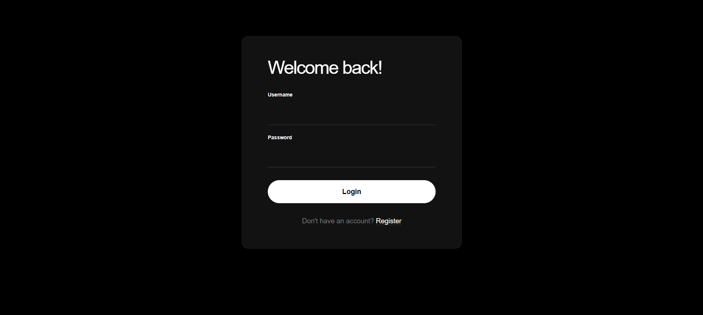
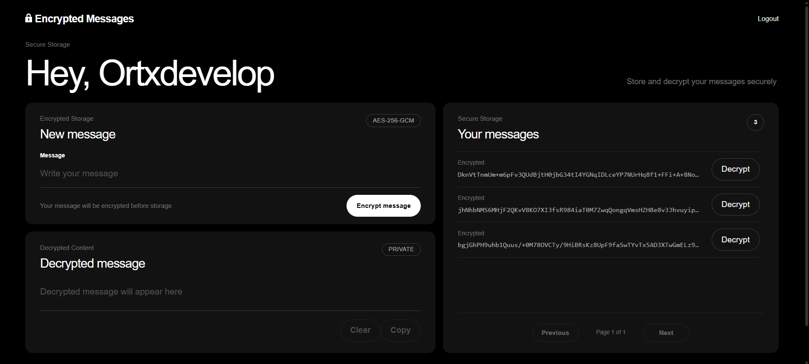
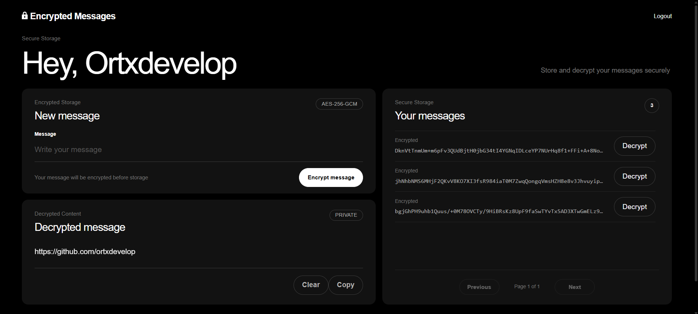

# Encrypted Messages Application

Store your messages securely with end-to-end encryption

## Demo





## Features

- 🔒 **AES-256-GCM Encryption**. All messages are encrypted before storage

- 🔑 **JWT Authentication**. Secure token-based authentication with refresh tokens

- 🛡️ **BCrypt Password Hashing**. Industry-standard password security

- ⏱️ **Rate Limiting**. Protection against brute force attacks (5 attempts, 15 min lockout)

- 📄 **Pagination**. Efficient message loading

- 📱 **Responsive Design**. Works on desktop, tablet and mobile

- 🐳 **Docker Support**. Easy deployment with Docker Compose

## Tech Stack

**Frontend:**

- React 19

- Vite

- React Router

**Backend:**

- Java 21

- Spring Boot 4.1.1

- Spring Security

- Spring Data JPA

**Database:**

- PostgreSQL 16

**Infrastructure:**

- Docker Compose

- Nginx (reverse proxy)

## Prerequisites

- Docker Desktop (Windows/Mac). Docker + Docker Compose (Linux)

- Git (optional for cloning)

## Quick Start with Docker

### 1. Generate Security Keys

**Option A. PowerShell (Windows):**

```powershell

# Generate JWT Secret (32+ characters)

[Convert]::ToBase64String((1..32 | ForEach-Object { Get-Random -Minimum 0 -Maximum 256 }))

# Generate Encryption Key (32 bytes, base64-encoded)

[Convert]::ToBase64String((1..32 | ForEach-Object { Get-Random -Minimum 0 -Maximum 256 }))

```

**Option B. Bash/Linux:**

```bash

# Generate JWT Secret

openssl rand -base64 32

# Generate Encryption Key

openssl rand -base64 32

```

**Option C. Node.js:**

```bash

# Generate Encryption Key

node -e "console.log(require('crypto').randomBytes(32).toString('base64'))"

```

### 2. Configure Backend Environment

Copy the example file. Add your generated keys:

```bash

cp backend/.env.example backend/.env

```

Edit `backend/.env` and replace the placeholder values:

```env

JWT_SECRET=<your-generated-jwt-secret>

ENCRYPTION_KEY=<your-generated-encryption-key>

```

### 3. Configure Frontend (Optional)

For Docker setup no changes needed. For development:

```bash

cp frontend/.env.example frontend/.env

```

### 4. Start Application

```bash

docker-compose up -d

```

This will:

- Build frontend and backend images

- Start PostgreSQL database

- Start backend on port 8080

- Start frontend with Nginx on port 80

### 5. Access Application

Open your browser. Navigate to:

```

http://localhost

```

**Test Account (already created):**

- Username: `test`

- Password: `TestPassword1`

Or register a new account.

## Development Setup (Without Docker)

### Backend

1. Install Java 21. Maven

2. Configure `backend/.env` with your keys

3. Run PostgreSQL locally. Use Docker:

```bash

docker run -d -p 5432:5432 -e POSTGRES_DB=secure_app -e POSTGRES_USER=postgres -e POSTGRES_PASSWORD=postgres postgres:16-alpine

```

4. Start backend:

```bash

cd backend

mvn spring-boot:run

```

Backend runs on http://localhost:8080

### Frontend

1. Install Node.js 20+

2. Configure `frontend/.env`:

```env

VITE_API_URL=http://localhost:8080

```

3. Install dependencies and start:

```bash

cd frontend

npm install

npm run dev

```

Frontend runs on http://localhost:5173

## Docker Commands

```bash

# Start all services

docker-compose up -d

# Stop all services

docker-compose down

# View logs

docker-compose logs -f

# View service logs

docker-compose logs -f backend

docker-compose logs -f frontend

# Rebuild after code changes

docker-compose build --no-cache

docker-compose up -d

# Remove all containers and volumes

docker-compose down -v

```

## Security

### Password Requirements

- Minimum 8 characters

- Maximum 64 characters

- At least one lowercase letter

- At least one uppercase letter

- At least one number

### Username Requirements

- 3-20 characters

- Letters, numbers and underscore only

### Rate Limiting

- 5 failed login attempts allowed

- 15 minute lockout after exceeding limit

## Project Structure

```

backend/

    src/main/java/secure_app/backend/

        auth/              # Authentication logic

        config/            # Spring configuration

        crypto/            # Encryption service

        exception/         # Exception handlers

        message/           # Message CRUD

        security/          # JWT & security

        user/              # User management

    Dockerfile

    .env.example

frontend/

    src/

        components/        # React components

        context/           # Auth context

        pages/             # Page components

        services/          # API services

        utils/             # Validation utilities

    Dockerfile

    nginx.conf

    .env.example

docker-compose.yml

```

## API Endpoints

### Authentication

- `POST /api/auth/register`. Register user

- `POST /api/auth/login`. Login

- `POST /api/auth/refresh`. Refresh access token

### Messages

- `GET /api/messages?page=0&size=20`. Get paginated messages

- `POST /api/messages`. Create encrypted message

- `POST /api/messages/{id}/decrypt`. Decrypt single encrypted message

## Troubleshooting

### Backend not starting

```bash

docker-compose logs backend

```

Check that JWT_SECRET and ENCRYPTION_KEY are properly set in backend/.env

### Frontend shows "Unable to connect to server"

1. Check backend is running: `docker-compose ps`

2. Check backend logs: `docker-compose logs backend`

3. Verify nginx.conf configuration

### Database connection error

```bash

docker-compose logs postgres

```

Ensure PostgreSQL container is healthy before backend starts

### Port in use

Stop services using ports 80, 8080 or 5432:

```bash

# Windows

netstat -ano | findstr :80

taskkill /PID <pid> /F

# Linux/Mac

lsof -ti:80 | xargs kill -9

```

## License

Project was created as part of recruitment process and is shared for portfolio and demonstration purposes.
You are free to use, modify and distribute this code

## Contact

Created by [ortxdevelop](https://github.com/ortxdevelop)  
For questions or support, please open an issue on GitHub

---

**Thank you for checking out this project!** 👾